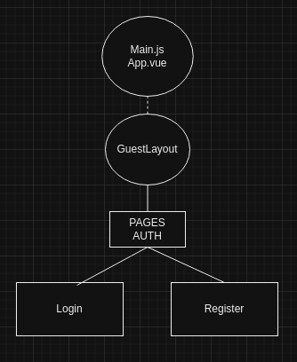
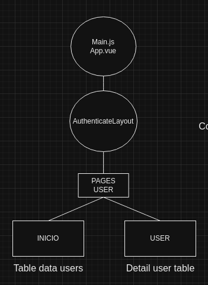
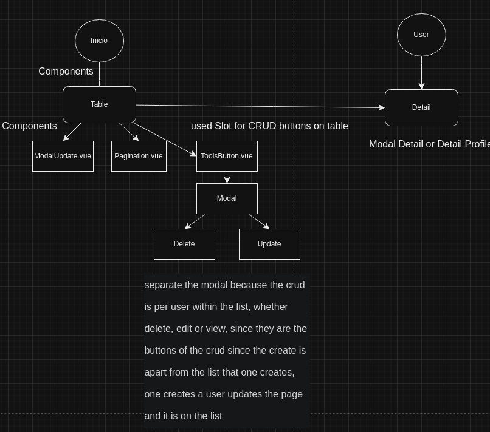

# Vue 3 + Vite

<p align="center"><a href="https://laravel.com" target="_blank"></a></p>
<br/>


# Test Solution
Solution to the developer evaluation challenge. Vue/Vite.

## Autor
Diego Ramos Rios diegoe.ramosrios@gmail.com

## Technologies
- Vue
- Vuex
- Docker
- Docker-compose
- Vite
- Tailwindcss

## Installation
### credentials to enter the application
- User: admin@example.com
- password: Password123!

### Environment variables

Copy `.env.example` to `.env` and set all values.

- `NODE_ENV`: Environment. Values `local` or `development`.
- `PORT`: The application port exposed.

### Docker configuration

- `DOCKER_DB_PORT`= The port of docker database container
- `DOCKER_APP_PORT`= The application port exposed in docker container.

### Documentation
The endpoint descriptions are defined with swagger in the [/api/docs](http://127.0.0.1:8000/api/docs) local or with docker [/api/docs](http://localhost:8080/api/docs) 

## Run the app

### 🏗️ Run with Docker in local

## Windows
### Using Makefile on Windows
Using Makefile on Windows
It should be remembered that if you are on Windows the makefile file will work by installing the following tools

- MSYS2
- Cygwin
- MinGW
- WSL
- Git Bash

#### The best option is to go to the makefile file and copy the codes of each definition

### Create containers
```
$ docker compose -f ./docker/docker-compose.local.yml --project-directory ./ -p vue-vite down
```
```
$ docker compose -f ./docker/docker-compose.local.yml --project-directory ./ -p vue-vite build --no-cache
```
```
$ docker compose -f ./docker/docker-compose.local.yml --project-directory ./ -p vue-vite up -d db app
```

## Linux / Ubuntu
Run the command to build docker images:

```
$ make run-local
```

## Tests
To run the tests you must execute:

```
$ make tests

or

$ make test-coverage

```
#### The testing tool used was PestPHP for its simplicity in describing the tests.


## File Structure

What I did was separate the design (layout) of the page and the components. Inside components, I can use Vue tools like slot to manipulate components inside others.

For Example

<p align="center"><a  target="_blank"></a></p>


<p align="center"><a  target="_blank"></a></p>


<p align="center"><a  target="_blank"></a></p>

